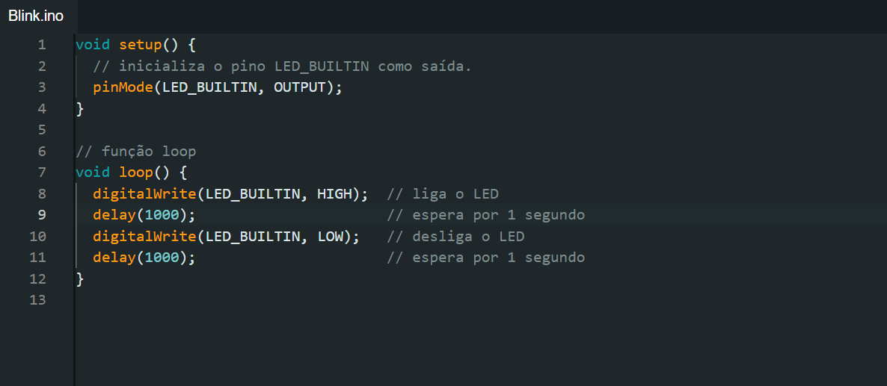
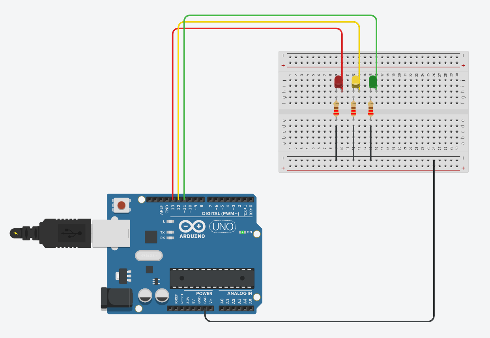

# Ponderada de Programação - Semana 1

## Parte 1 - Blink Led Interno

### Código
Para a primeira parte da ponderada, eu desenvolvi o seguinte código:

<div align="center">
<sub>Figura 1 - Código do "blink" </sub><br>
<br>
</div>

### Vídeo de demonstração
Para facilitar a vizualização, fiz upload do vídeo de funcionamento do "blink", que eu já havia commitado no repositório, no Youtube: https://youtube.com/shorts/nsd0Sb_MlO0?feature=share

## Parte 2 - Simulando Blink Externo

### Código

Para a segunda parte da ponderada, eu desenvolvi um semáforo com três leds, que alternam o seu funcionamento de acordo com o código abaixo:

```c++
void setup() {
  // Define o pino 11 como saída
  pinMode(11, OUTPUT);
  
  // Define o pino 12 como saída
  pinMode(12, OUTPUT);
  
  // Define o pino 13 como saída
  pinMode(13, OUTPUT);
}

void loop() {
  // Ativa o LED no pino 13 (HIGH) e desativa os LEDs nos pinos 12 e 11 (LOW)
  digitalWrite(13, HIGH);
  digitalWrite(12, LOW);
  digitalWrite(11, LOW);

  // Espera 1 segundo
  delay(1000);

  // Desativa o LED no pino 13, ativa o LED no pino 12 e mantém o LED no pino 11 desligado
  digitalWrite(13, LOW);
  digitalWrite(12, HIGH);
  digitalWrite(11, LOW);

  // Espera 1 segundo
  delay(1000);

  // Desativa os LEDs nos pinos 13 e 12, e ativa o LED no pino 11
  digitalWrite(13, LOW);
  digitalWrite(12, LOW);
  digitalWrite(11, HIGH);

  // Espera 1 segundo
  delay(1000);
}

```

### Circuito 

<div align="center">
<sub>Figura 2 - Circuito do "Semáforo" </sub><br>
<br>
</div>
